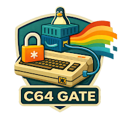
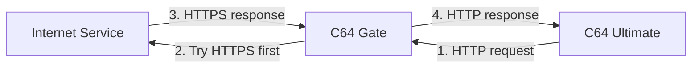
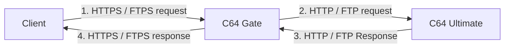

# C64 Gate

C64 Gate is a Linux gateway for Commodore 64 Ultimate devices, packaged as a single Docker image 

It sits between the device and the rest of the network, secures inbound and outbound traffic via TLS, and gives you packet capture, structured logs, and a small control plane.

> [!NOTE]
> This project is under active development. Some documented features may not yet be fully functional.

## How Does It Work

C64 Gate sits between the Commodore 64 Ultimate and the outside world.  
It protects the device by securing inbound connections and upgrading outbound traffic whenever possible.

### Outbound Protection

When the C64 Ultimate makes a network request, C64 Gate attempts to upgrade insecure HTTP connections to HTTPS automatically.



---

### Secure Inbound Access

External clients connect securely to C64 Gate.  
The gateway then communicates with the C64 Ultimate on its internal network.



## What You Get

- One container image for the complete gateway runtime
- Linux-native firewalling with nftables
- DHCP and local naming for the device-side network
- HTTPS and FTPS front ends for inbound access
- Automatic outbound HTTP to HTTPS upgrade when possible
- Packet capture with Wireshark tooling behind the scenes
- Canonical JSON logs for traffic and daemon events
- A small FastAPI control plane for health, readiness, and dashboard views

For more information see the [Architecture](./doc/architecture.md) document.

## Good First Outcome

If you only want a quick proof that the project works, the shortest useful path is:

1. Install Docker on a Linux machine.
2. Run `docker compose up --build` in this repository.
3. Open `https://127.0.0.1:8443/health` with the configured dashboard credentials and confirm the service answers.
4. Open `https://127.0.0.1:8443/ready` with the configured dashboard credentials and inspect the runtime status.

That path uses the same production image the tests validate. By default, the Compose setup runs in simulation mode so you can explore the system without attaching a real device or changing host networking more than necessary.

If Docker is new to you, use the official installation guides rather than learning that from this README:

- [Docker Engine install guide](https://docs.docker.com/engine/install/)
- [Docker Compose guide](https://docs.docker.com/compose/)

## Quick Start

Minimum requirements:

- Linux host
- Docker with the Compose plugin

Start the stack:

```bash
docker compose up --build
```

Run a specific published image from GHCR locally:

```bash
mkdir -p data/caddy data/logs data/pcap
chmod 0777 data/caddy data/logs data/pcap

docker run -d \
  --name c64gate-ghcr \
  --cap-drop ALL \
  --cap-add NET_ADMIN \
  --cap-add NET_RAW \
  --read-only \
  --tmpfs /run \
  --tmpfs /tmp \
  -e C64GATE_SIMULATION_MODE=1 \
  -e C64GATE_DASHBOARD_PASSWORD=changeme \
  -p 127.0.0.1:8443:8443 \
  -v "$PWD/data/caddy:/var/lib/c64gate/caddy" \
  -v "$PWD/data/logs:/var/lib/c64gate/logs" \
  -v "$PWD/data/pcap:/var/lib/c64gate/pcap" \
  ghcr.io/chrisgleissner/c64gate:0.0.1
```

If you want the published image to front a real C64 REST endpoint instead of the simulation target, set `C64GATE_SIMULATION_MODE=0` and provide `C64GATE_REST_BACKEND_URL=http://<c64u-ip>`.

### Required Hardware Setup

The C64 Ultimate must not have any direct network path to your normal LAN or the Internet. If it does, the gateway cannot guarantee that all outbound traffic is inspected and upgraded through C64 Gate.

To guarantee that all outbound traffic flows through the gate:

1. Disable Wi-Fi on the C64 Ultimate.
2. Connect the C64 Ultimate by Ethernet only to the gateway host's device-side network.
3. Ensure the gateway host has a separate uplink path to the outside network.
4. Make the C64 Ultimate receive its IP configuration and default gateway from C64 Gate.
5. Do not connect the C64 Ultimate to any other switch, Wi-Fi, or routed segment in parallel.

Two practical hardware topologies are recommended:

1. Raspberry Pi gateway:
    Use one Ethernet interface on the Pi for the C64U device-side link and use the Pi's Wi-Fi or a second Ethernet adapter as the uplink. The C64U should be connected only to the Pi-facing Ethernet segment.
2. PC with two network interfaces:
    Use one NIC for the isolated C64U-facing network and a second NIC for the uplink to your normal LAN or Internet. Do not bridge those interfaces outside the gateway runtime.

In both setups, the important property is the same: the C64U has exactly one physical path off-device, and that path terminates at the C64 Gate host.

To proxy a real C64 REST API instead of the default local simulation target, set `C64GATE_REST_BACKEND_URL` to the device's plain HTTP endpoint before starting Compose. Example:

```bash
C64GATE_REST_BACKEND_URL=http://192.168.1.167 docker compose up --build
```

Useful endpoints after startup:

- `https://127.0.0.1:8443/health`
- `https://127.0.0.1:8443/ready`
- `https://127.0.0.1:8443/v1/version` for the relayed device version endpoint
- `https://127.0.0.1:8443/api/v1/info` for the HTTPS REST facade

Management access notes:

- The default Compose profile no longer publishes `8081`; management traffic must enter through the HTTPS facade.
- `/health`, `/ready`, and `/dashboard/*` require the configured dashboard credentials.
- `C64GATE_DASHBOARD_PASSWORD` must be changed from `changeme` outside simulation mode or the runtime will refuse to start.

If you want host port `443` instead of `8443`, set `C64GATE_HTTPS_HOST_PORT=443` before starting Compose. On rootless Docker hosts, publishing `443` may require lowering `net.ipv4.ip_unprivileged_port_start` or using a rootful Docker daemon.

For a normal `https://127.0.0.1/...` experience in Chrome without certificate warnings, use the project helper scripts:

```bash
sudo ./scripts/setup-host-https.sh
C64GATE_HTTPS_HOST_PORT=443 C64GATE_REST_BACKEND_URL=http://192.168.1.167 docker compose up -d --build
./scripts/trust-caddy-local-ca.sh
```

This keeps Docker rootless, keeps the container itself unprivileged, and applies the minimum host changes needed for a conventional local HTTPS entry point.

Stop the stack:

```bash
docker compose down
```

The default Compose file mounts logs and packet captures into `data/logs` and `data/pcap` so you can inspect outputs from the host.
The Caddy local CA state under `data/caddy` should be treated as secret material and kept out of broad backups or sharing workflows.

## When You Want More Than A Demo

Use the root build script for the standard workflows:

```bash
./build help
./build test
./build image
./build smoke
./build ci
```

Python dependency installs are enforced from the hash-locked manifests `requirements.lock.txt` and `requirements-dev.lock.txt`.

You only need Python if you want to run the local lint and test workflow outside the containerized smoke path.

The most useful follow-on documents are:

- [doc/developer.md](doc/developer.md) for local developer workflows
- [doc/architecture.md](doc/architecture.md) for the system design and locked technology choices
- [doc/traceability-matrix.yaml](doc/traceability-matrix.yaml) for requirement-to-code-to-test coverage

## Operating Notes

- v1 is Linux only.
- The project is designed as a router-mode gateway, not a generic cross-platform desktop app.
- Real firewall enforcement, DHCP service, and device traffic capture are best exercised on a disposable Linux host or an isolated lab network.
- The runtime depends on Linux networking capabilities such as `NET_ADMIN` and `NET_RAW`.
- Strict TLS mode is available through `C64GATE_STRICT_TLS_MODE=1`; default fallback HTTP remains an exception path for compatibility and should be limited to trusted environments.
- Telnet and other plaintext paths remain compatibility features and should not be exposed outside a trusted administrative enclave.

## Non-Goals In V1

- macOS or Windows runtime support
- bridge mode
- DNS policy enforcement
- cloud-hosted control plane services
- large analytics platforms
