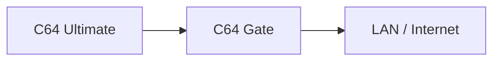
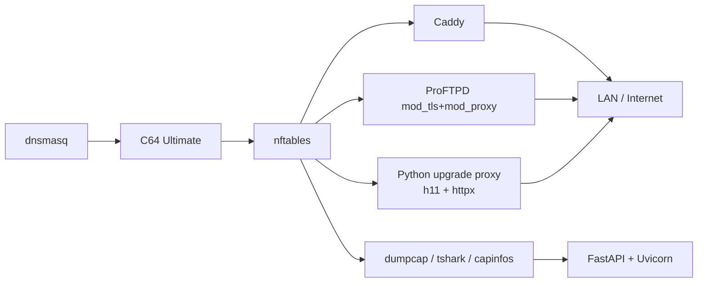
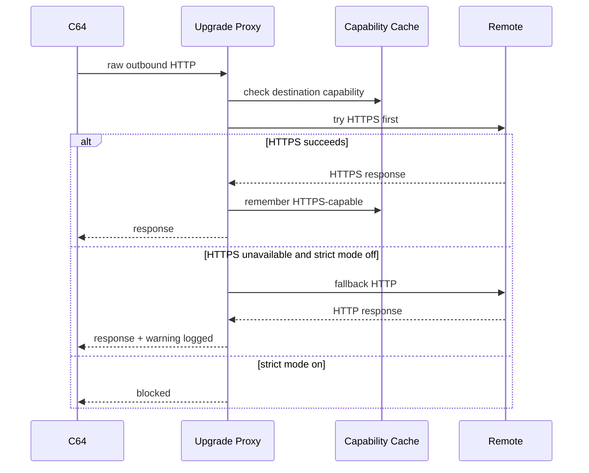
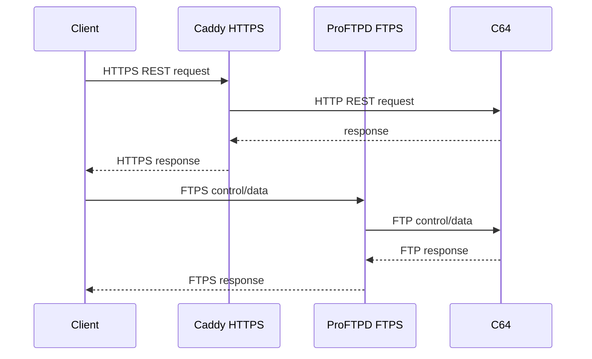
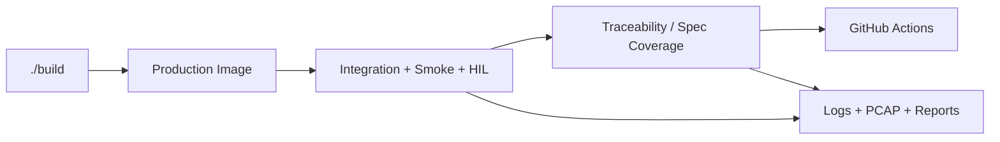

# C64 Gate Architecture

## 1. Purpose

C64 Gate is a containerized firewall, secure gateway, and observability layer for Commodore 64 Ultimate devices.

The gateway sits between the device and the network and provides:

- network firewall containment
- encrypted inbound access
- outbound HTTP → HTTPS upgrade
- full network observability
- packet capture
- structured logging
- traffic dashboard
- DHCP service for the device-side network

The gateway assumes firmware may be untrusted and must therefore monitor and control all network traffic.

`doc/architecture.md` is the single source of truth for implementation.

The first implementation targets **Linux only**. Support for macOS and Windows is explicitly out of scope for the first release.

---

## 2. Design Principles

C64 Gate is designed with the following principles:

- Security first
- Observability first
- Minimal external dependencies
- Self-contained containerized runtime
- Modern open source tooling
- Modular architecture appealing to senior engineers
- Reproducible builds
- Spec-driven development
- Production hardening from day one
- Resource efficiency suitable for constrained systems such as Raspberry Pi Zero 2 W

---

## 3. Technology Selections - Locked

The stack is locked down as follows and must not be re-evaluated unless implementation proves a concrete blocker. Any such blocker requires an architecture amendment before code changes proceed.

### 3.1 Base Runtime

- **Base OS**: Debian stable slim image
- **Primary implementation language**: Python
- **Container orchestration**: Docker Compose
- **Build entry point**: root-level `build` Bash script

### 3.2 Firewall and Routing

- **Firewall / NAT / policy engine**: `nftables`
- **Reason**:
  - nftables is the modern Linux packet-filtering framework and unifies multiple networking levels behind a single `nft` tool.
  - nftables supports atomic ruleset replacement, which is important for deterministic and safe firewall updates.
- **Operational policy**:
  - default deny
  - explicit allowlist support
  - block RFC1918 by default
  - block direct access to the host except required gateway services
  - log every block and allow decision

### 3.3 DHCP and Lightweight DNS

- **DHCP / local DNS / local host naming**: `dnsmasq`
- **Reason**:
  - dnsmasq is explicitly designed to provide DNS and DHCP for small networks.
  - dnsmasq is lightweight and suitable for resource-constrained routers and firewalls.
- **Scope**:
  - authoritative DHCP on the device-side network
  - local hostname support such as `c64gate.local`
  - passive DNS observability only
  - no DNS policy enforcement in v1

### 3.4 Inbound HTTPS Façade

- **Inbound HTTP TLS termination**: `Caddy`
- **Selected distribution**: official upstream Caddy binary, pinned to **2.11.2 or later**
- **Do not use**: Debian-packaged Caddy
- **Reason**:
  - Caddy provides a built-in reverse proxy and built-in HTTP request logging.
  - Caddy supports `basic_auth`.
  - Caddy supports a fully managed local CA for internal names and IPs, which is ideal for LAN-first deployment.
  - Versions prior to 2.11.1 are affected by CVE-2026-27588.
  - Debian package listings still show Caddy 2.6.2 in stable/testing package views, so the distro package is not acceptable for this project.
- **Responsibilities**:
  - HTTPS façade for C64 REST API
  - dashboard TLS and authentication
  - JSON access logs
  - request metadata propagation to the project log pipeline

### 3.5 Inbound Secure FTP Façade

- **Secure FTP reverse proxy**: `ProFTPD` + `mod_tls` + `mod_proxy`
- **Reason**:
  - ProFTPD `mod_tls` implements FTPS.
  - ProFTPD `mod_proxy` supports forward and reverse proxying of FTP/FTPS connections.
  - This avoids inventing a fragile ad hoc FTP wrapper.
- **Responsibilities**:
  - secure FTPS façade in front of the backend C64 FTP service
  - protocol-aware proxying for FTP control/data handling
  - logging of connection metadata, latency, and bytes transferred

### 3.6 Outbound HTTP → HTTPS Upgrade Engine

- **Selected implementation**: custom Python service
- **HTTP parser**: `h11`
- **Upstream client**: `httpx`
- **Reason**:
  - The requirement is specifically for **raw outbound HTTP interception and HTTPS-first upgrade**, not for generic full HTTP(S) MITM.
  - `h11` is a simple, robust, spec-focused HTTP/1.1 protocol library.
  - `httpx` provides both synchronous and asynchronous APIs with HTTP/1.1 and HTTP/2 support.
  - A small purpose-built Python upgrade service is simpler and lighter than deploying a broader general-purpose intercepting proxy for this narrow requirement.
- **Behavior**:
  - transparently intercept outbound raw HTTP
  - always try HTTPS first
  - cache upgrade capability per destination
  - fall back to HTTP in default mode
  - block fallback in strict TLS mode
  - strict certificate validation by default on upgraded HTTPS
  - warning log when HTTPS is unavailable and fallback is used
- **Explicit rejection**:
  - `Squid` is not selected because, once Squid is engaged for an intercepted request, it cannot transparently declare itself out of the flow and must either service or fail the request. That conflicts with the required HTTPS-first-then-HTTP-fallback behavior.

### 3.7 Packet Capture and PCAP Inspection

- **Long-running capture engine**: `dumpcap`
- **Packet decode and assertions**: `tshark`
- **Capture metadata and summary checks**: `capinfos`
- **Reason**:
  - `dumpcap` is the dedicated Wireshark capture tool and is explicitly recommended for long-term capturing.
  - `tshark` provides protocol decoding and file inspection suitable for tests and debugging.
  - `capinfos` provides capture statistics and summary reporting.
- **Responsibilities**:
  - rolling PCAP capture
  - rotation by size and time
  - PCAP validation in tests

### 3.8 Dashboard, Health, and Control Plane

- **Dashboard / health API / log query API**: `FastAPI`
- **ASGI server**: `Uvicorn`
- **Reason**:
  - FastAPI is a modern high-performance Python web framework.
  - Uvicorn is a minimal ASGI server.
  - A lightweight in-process dashboard/API over the project’s own JSON logs is more suitable for Raspberry Pi Zero 2 W constraints than introducing a heavier network analytics platform for v1.
- **Authentication**:
  - HTTP Basic Auth at the FastAPI layer is allowed for the internal dashboard API
  - Caddy may additionally protect the dashboard externally
- **Responsibilities**:
  - health and readiness endpoint
  - authenticated dashboard
  - recent flow and decision summaries derived from project JSON logs
  - spec and runtime self-check endpoints where helpful

### 3.9 Logging Pipeline

- **Primary log format**: JSON lines
- **Log ownership**:
  - Python services emit canonical project JSON directly
  - Caddy emits JSON access logs
  - ProFTPD logs are normalized into the canonical project JSON format by a lightweight Python adapter
  - nftables/firewall events are normalized into canonical project JSON
- **Reason**:
  - unified JSON logs are required by the architecture
  - project-owned normalization avoids coupling dashboard logic to multiple daemon-specific formats

### 3.10 Packaging Policy

- Prefer distro packages for:
  - dnsmasq
  - nftables
  - ProFTPD and `mod_proxy`
  - Wireshark CLI tools
- Prefer upstream pinned binaries for:
  - Caddy
- Prefer pinned Python dependencies for:
  - FastAPI
  - Uvicorn
  - h11
  - httpx
- Avoid privileged containers unless implementation proves unavoidable.

---

## 4. Research-Based Rationale Summary

The stack above is selected because it best matches the stated requirements: idiomatic, simple, free, open source, maintainable, and resource-aware.

- nftables is the modern Linux packet-filtering framework and supports atomic ruleset replacement.
- dnsmasq is lightweight and explicitly aimed at small networks and resource-constrained routers/firewalls.
- Caddy is a fast lightweight web server with a built-in reverse proxy, built-in access logging, built-in `basic_auth`, and a managed local CA for internal names and IPs.
- Caddy must be pinned to 2.11.1 or later because earlier versions are affected by CVE-2026-27588.
- ProFTPD `mod_tls` implements FTPS, and `mod_proxy` supports forward and reverse proxying of FTP/FTPS.
- Squid was rejected because intercepted requests cannot be transparently bypassed once Squid is engaged, which is incompatible with the required HTTPS-first-then-HTTP-fallback behavior.
- dumpcap is the Wireshark capture engine intended for long-term capture; tshark and capinfos provide CLI decode and inspection.
- FastAPI and Uvicorn are selected for a minimal Linux-native dashboard and health plane instead of a heavier traffic-analysis platform.
- For outbound HTTP upgrade, a small Python service built on `h11` and `httpx` is the best fit because the requirement is narrow and plain-HTTP-specific.

---

## 5. Topology



The gateway acts as a **router** for the device network.

Bridge mode is not supported in the first release.

---

## 6. Network Model

Router mode is mandatory.

Gateway responsibilities:

- DHCP service
- firewall enforcement
- traffic routing
- packet capture
- traffic logging

Example network layout:

- device-side subnet: `192.168.50.0/24`
- gateway device-side address: `192.168.50.1`
- gateway hostname: `c64gate.local`

The C64 obtains its address via DHCP.

All interfaces and subnets must remain configurable.

---

## 7. Supported Protocols

### 7.1 Incoming to C64

- REST API (HTTP)
- FTP
- Telnet
- TCP streaming endpoint

Gateway behavior:

- REST → secured via HTTPS façade
- FTP → secured via FTPS façade
- Telnet → passed through unchanged but logged
- TCP stream → passed through unchanged but logged

### 7.2 Outgoing from C64

- HTTP
- UDP streams

Gateway behavior:

- HTTP → transparently upgraded to HTTPS when possible
- UDP → passed through unchanged but logged

High-traffic UDP logging must default to **summary mode**. Verbose mode may enable detailed stream logs.

---

## 8. Core Functional Requirements

### 8.1 Firewall

Default deny policy.

Allow:

- `commodore.net`
- explicitly configured local-network destinations

Block:

- RFC1918 networks by default
- host access unless explicitly required

All decisions must be logged.

### 8.2 DHCP Server

Gateway must provide DHCP for the device network.

Responsibilities:

- assign IP
- provide gateway address
- provide DNS

### 8.3 Inbound TLS Proxy

Provides encrypted access to:

- REST API
- FTP

Responsibilities:

- TLS termination
- header rewriting where necessary
- access logging

Logs must include:

- timestamp
- latency
- bytes transferred
- headers
- request metadata

Verbose mode additionally logs request and response bodies where applicable.

### 8.4 Outbound HTTP Upgrade Proxy

Algorithm:

1. intercept raw outbound HTTP
2. attempt HTTPS first
3. consult and update destination capability cache
4. if HTTPS succeeds, use HTTPS
5. if HTTPS is unavailable and strict mode is disabled, fall back to HTTP
6. if strict mode is enabled, block instead of falling back
7. log outcome, latency, bytes, warnings, and fallback reason

### 8.5 DNS Observability

DNS traffic is **observed only**.

The gateway must:

- capture DNS requests
- capture DNS responses
- log metadata

DNS policy enforcement is out of scope for v1.

### 8.6 Packet Capture

Capture all device network traffic.

Requirements:

- PCAP output
- rotation by size and time
- tests must verify packet contents

### 8.7 Dashboard

Requirements:

- authenticated access
- low resident footprint
- Linux-native
- backed by project JSON logs and summaries
- availability validated in CI

### 8.8 Logging

All logs must be JSON.

Each event logs:

- timestamp
- protocol
- direction
- source
- destination
- action
- blocked or granted decision
- latency
- bytes transferred
- correlation identifier

Verbose mode logs headers and payloads where applicable.

Stream logging verbosity must be separately configurable.

---

## 9. Security Model

Gateway assumes C64 firmware may be hostile.

Security layers:

- mandatory gateway routing
- firewall containment
- encrypted inbound access
- outbound HTTPS upgrades
- optional strict TLS mode
- full traffic logging
- packet capture

Default configuration prevents the device from reaching internal network systems.

---

## 10. Container Architecture

The system ships as **one production Docker image**.

Docker Compose orchestrates the runtime around that image.

Production image must not contain the full test suite.

Test containers are allowed as sidecars.

The image must support:

- `linux/amd64`
- `linux/arm64`

The container should avoid privileged mode where possible.

---

## 11. Build System

A single root script called `build` is the entry point for:

- build
- test
- smoke tests
- CI-like local validation

The script must provide idiomatic help:

```bash
./build --help
```

---

## 12. Test Strategy

### 12.1 CI Tests

CI runs on GitHub Actions Linux runners.

Tests must validate:

- firewall behavior
- HTTPS façade
- FTPS façade
- HTTP upgrade behavior
- strict TLS behavior
- packet capture contents
- JSON logging
- dashboard availability
- health and readiness
- traceability / spec coverage

Artifacts must include:

- logs
- PCAP files
- spec coverage outputs

### 12.2 Hardware Tests

Optional local tests using a real device reachable as `c64u`.

Only non-destructive calls are allowed.

These tests run locally only.

---

## 13. Repository Layout

```text
c64gate/
├─ .github/
│  └─ workflows/
├─ config/
│  ├─ caddy/
│  ├─ dnsmasq/
│  ├─ nftables/
│  ├─ proftpd/
│  └─ logging/
├─ docker/
├─ doc/
│  ├─ architecture.md
│  └─ developer.md
├─ scripts/
├─ src/
│  ├─ controlplane/
│  ├─ upgrade_proxy/
│  ├─ log_normalizer/
│  └─ common/
├─ tests/
│  ├─ integration/
│  ├─ smoke/
│  ├─ hil/
│  └─ fixtures/
├─ data/
│  ├─ logs/
│  └─ pcap/
├─ PLANS.md
├─ WORKLOG.md
├─ README.md
├─ LICENSE
├─ docker-compose.yml
└─ build
```

---

## 14. Licensing

Project license: **GPL-v3**

---

## 15. Mermaid Diagrams

### 15.1 Runtime Topology



### 15.2 Outbound Upgrade Flow



### 15.3 Inbound Secure Access Flow



### 15.4 Build and Verification Flow



---

## 16. Explicitly Rejected Alternatives

The following are intentionally rejected for v1:

- **iptables as the primary firewall layer**: rejected in favor of nftables
- **Squid for outbound upgrade logic**: rejected because intercepted requests cannot be transparently bypassed once Squid is engaged
- **Heavy dashboard suites for v1**: rejected in favor of a small project-owned FastAPI dashboard to stay within Pi Zero 2 W resource goals
- **Bridge mode**: rejected for v1
- **DNS enforcement / sinkholing**: rejected for v1
- **Cloud dependencies**: rejected
- **Non-Linux host support**: rejected for v1

---

## 17. Traceability Requirement

The implementation must maintain a traceability matrix mapping architecture requirements to:

- implementation components
- tests
- CI validation

This matrix is a required deliverable and must be enforced in CI.
